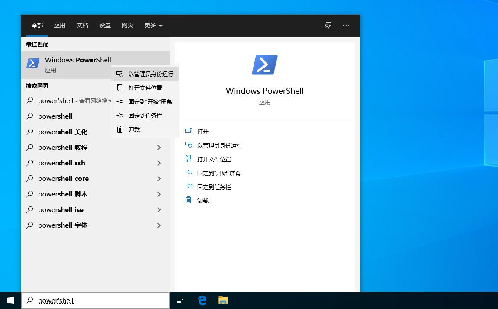
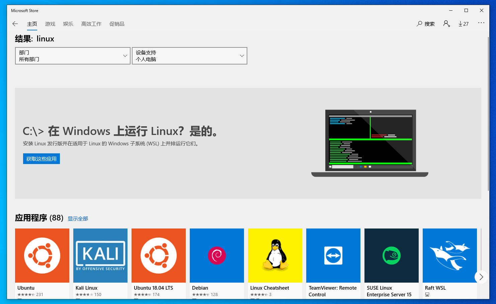
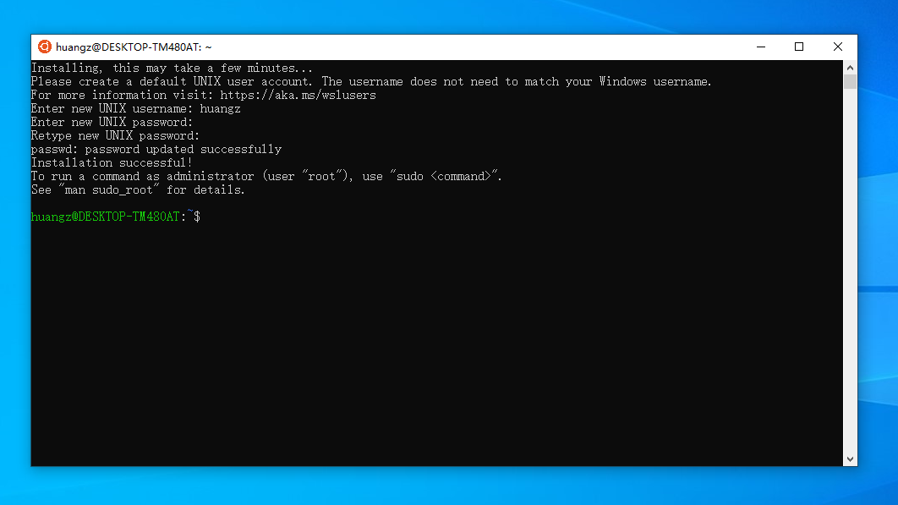

通过 Linux 子系统在 Windows 10 上安装 Ubuntu
==================================================

.. image:: image/wsl-screenfetch.png

Windows 10 的 `Linux 子系统 <https://docs.microsoft.com/en-us/windows/wsl/about>`_\ （Windows Subsystem for Linux，WSL）特性能够让我们在 Windows 平台上直接运行 Linux 系统及其之上的众多软件，
比如 bash 、Git 、Python 、Ruby 等等。

因为 WSL 是一个可选的特性，
所以我们在使用它之前必须先开启它，
具体的步骤是：

1. 在 Windows 系统的搜索框键入“powershell”，然后右键点击弹出的“Windows PowerShell“，选择“以管理员身份运行“。

2. 在弹出的 PowerShell 窗口输入命令 ``Enable-WindowsOptionalFeature -Online -FeatureName Microsoft-Windows-Subsystem-Linux`` ，然后回车。

3. 命令要求重启电脑以完成操作，再次按下回车键，重启电脑。

重启系统之后，
我们只要打开“Microsoft Store”并在搜索框中输入“Linux”，
然后就会看到相应的 WSL 引导页面，
点击“获取这些应用“即可进入 Linux 发行版选择页面。

Windows 为 WSL 提供了 Ubuntu 、SUSE 、Kali 等多种 Linux 发行版可选，
我们选择 Ubuntu 并点击“获取”，然后再点击“安装”即可。

安装完毕之后，
点击“启动”即可启动 Ubuntu 系统，
然后还会要求设置 UNIX 密码。

最后，
因为 WSL 初始安装的只是迷你版本的 Ubuntu 系统，
所以为了正常使用，
别忘了在安装系统之后执行 ``apt update`` 命令和 ``apt upgrade`` 命令安装和更新系统中的软件。

| 感叹 Windows 居然爱上了 Linux 的黄健宏
| 2020.2.6
